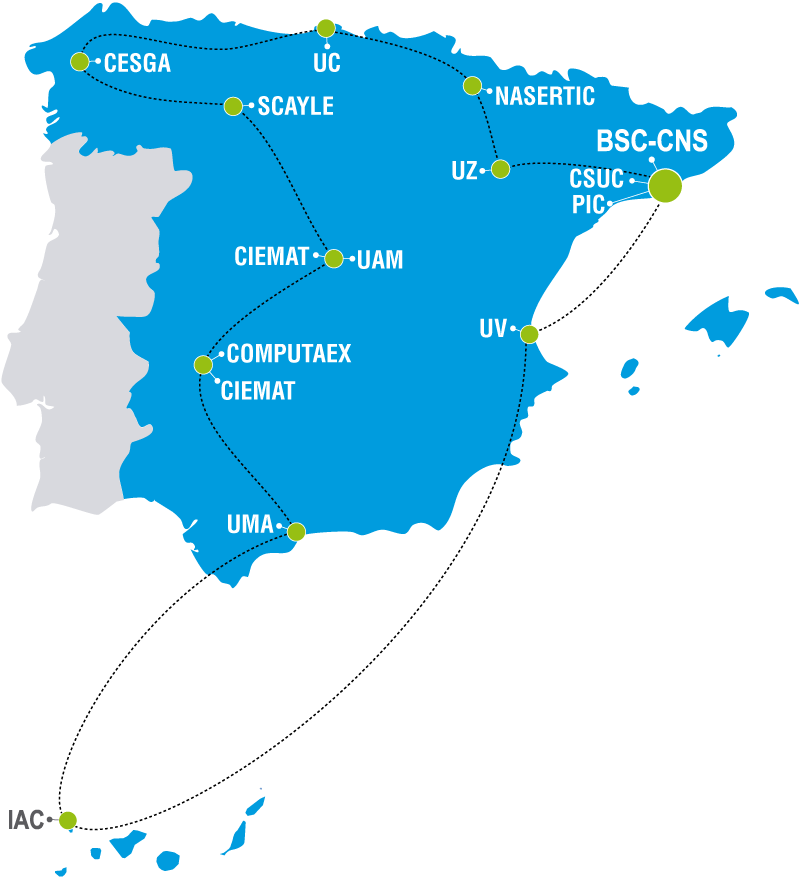
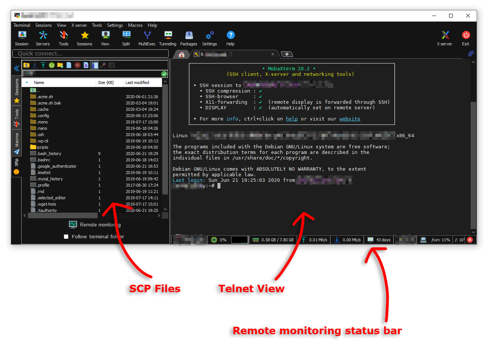
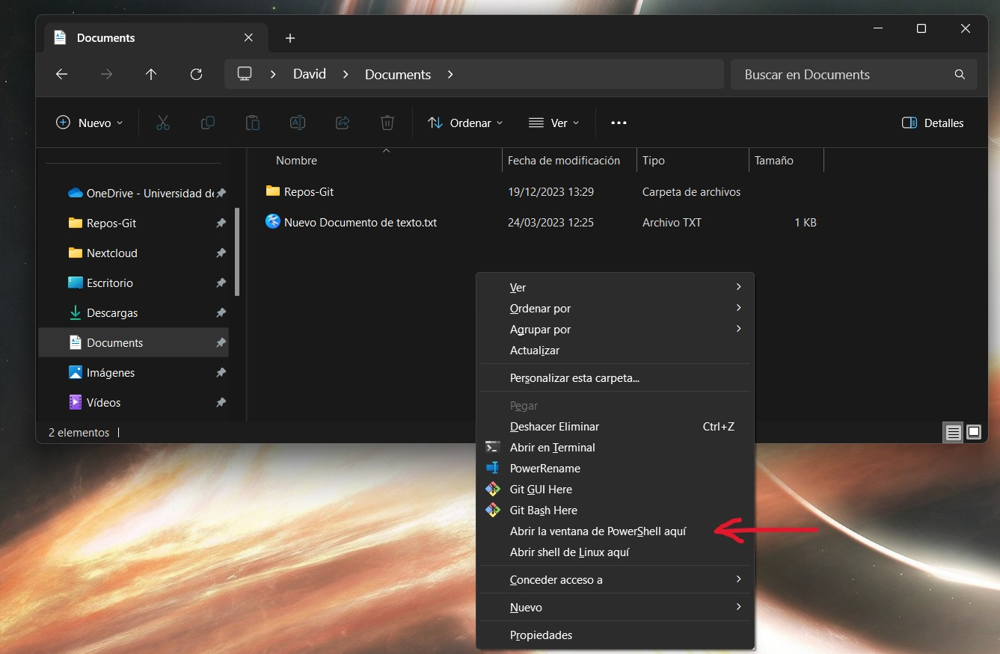
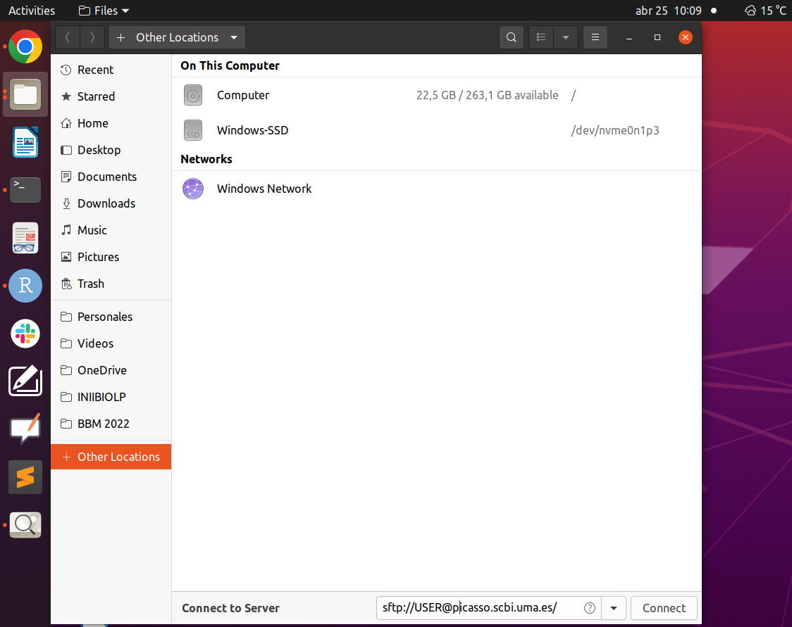
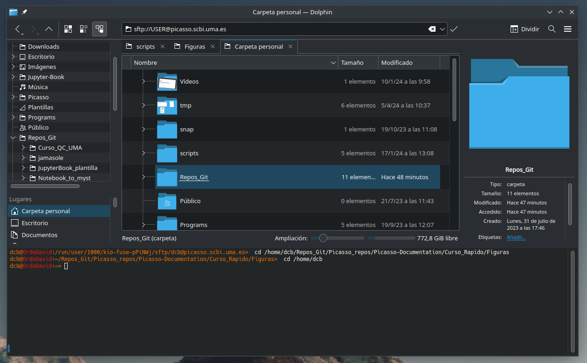
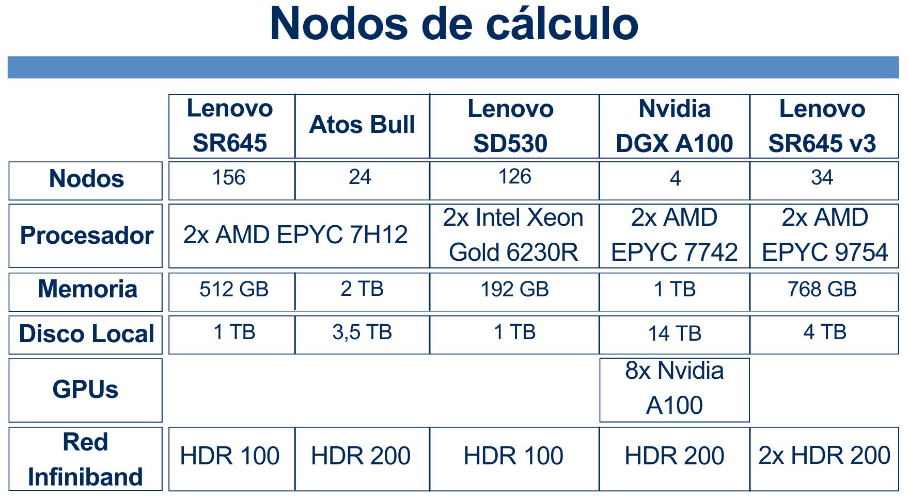
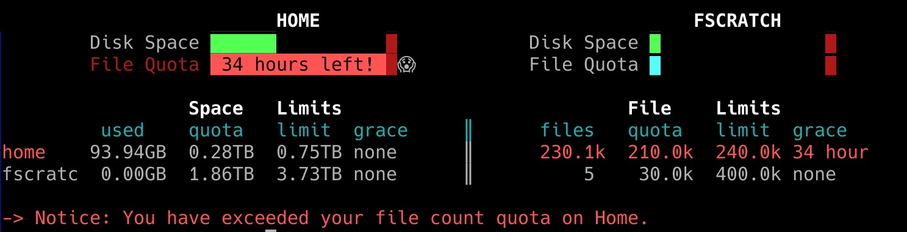
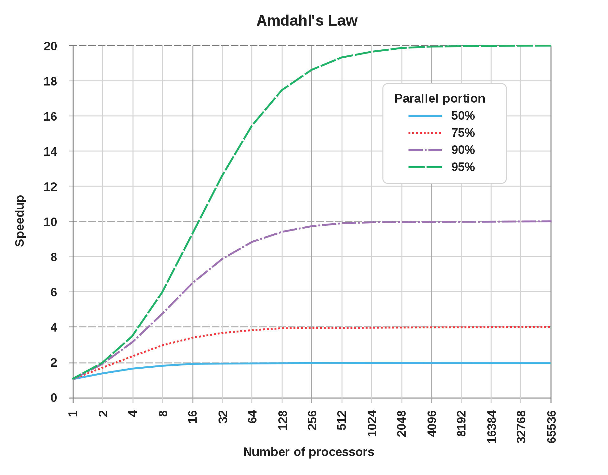
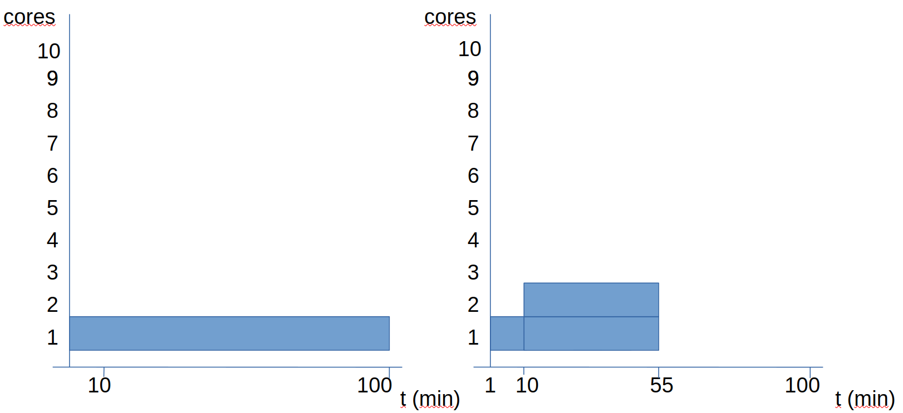
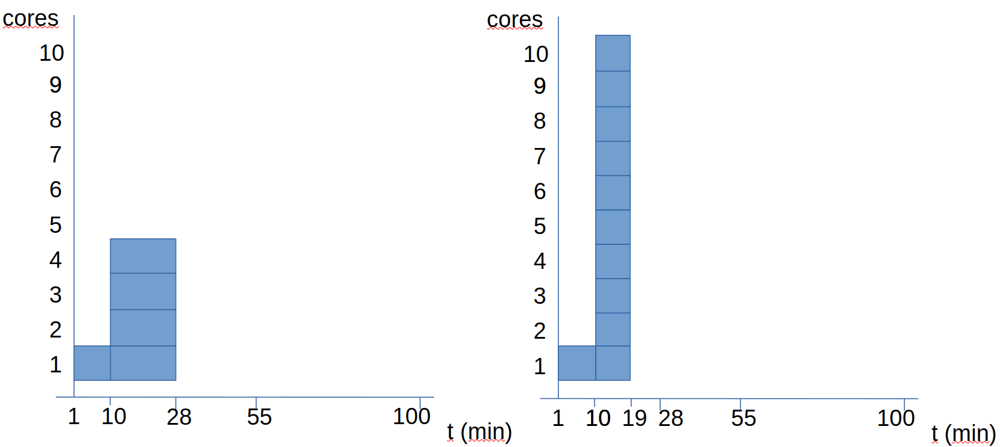

# Curso rápido de introducción a Picasso

Autores:
- *Rafael Larrosa Jiménez (Administrador de Sistemas - SCBI)* 
- *David Castaño Bandín (Administrador de Sistemas - SCBI)*
- *Manuel Guerrero Claro (Administrador de Sistemas - SCBI)*

Para cualquier duda, contactar con soporte@scbi.uma.es

Video explicativos sobre el curso [aquí](https://www.scbi.uma.es/web/rafael/curso_rapido_picasso_ok.mp4).

Puede verse más información sobre el uso de Picasso en nuestra [Documentación](https://www.scbi.uma.es/site/scbi/documentation)

**Añadir logos**

## Índice

- **[1 - Introducción](#sec_Intro)**
- **[2 - Acceso](#sec_acceso)**
- **[3 - Movimiento de ficheros](#sec_movimiento_ficheros)**
- **[4 - Recursos hardware](#sec_recursos_hardware)**
- **[5 - Sistema de ficheros / cuota](#sec_sistema_ficheros)**
- **[6 - Software](#sec_software)**
- **[7 - Nociones de paralelismo](#sec_Nociones_de_paralelismo)**
- **[8 - Sistema de colas](#sec_Sistema_de_colas)**
- **[9 - Array jobs](#sec_array_jobs)**
- **[10 - Usando GPUs](#sec_usando_GPUs)**

<a id='sec_Intro'></a>
## 1. Introducción

En España hay una serie de infraestructuras públicas denominadas **ICTS (Infraestructuras Científico Técnicas Singulares)**. El objetivo de estas es proveer a los investigadores españoles de medios competitivos para llevar a cabo investigaciones de vanguardia. 

<figure><center>
<a id='fig_ref'></a>

</center></figure>

Un ejemplo muy conocido de este tipo de infraestructuras son los famosos telescopios y observatorios astronómicos situados en Canarias. Si nos centramos más en el ámbito andaluz, tenemos la *Reserva Biológica de Doñana*, el *Observatorio Astronómico de Calor Alto* o la que nos compete en este curso: la **Red Española de Supercomputación (RES)** a través del nodo **Picasso**.

<figure><center>
<a id='fig_ref'></a>

</center></figure>

La RES está conformada por una serie de "nodos", es decir, una serie de **centros de supercomputación** repartidos por toda España. El SCBI con su supercomputador Picasso, con sus 40.000 núcleos, se sitúa como el **segundo nodo más potente de RES**, solo superado por el ampliamente conocido Marenostrum, situado en el BSC (Barcelona Supercomputer Center).

<figure><center>
<a id='fig_ref'></a>

</center></figure>

El SCBI también está inmerso en Computación Cuántica a través del proyecto QuantumSpain.

<figure><center>
<a id='fig_ref'></a>

</center></figure>


<a id='sec_acceso'></a>
## 2. Acceso

El acceso a Picasso se realiza usando el protocolo ssh en línea de comandos:
```
ssh -X <user>@picasso.scbi.uma.es
```
Donde `<user>` debe de sustituirse por el usuario correspondiente. Este comando se puede ejecutar en:
- Un terminal de Linux
- Un terminal de MacOs
- Un PowerShell en Windows


<div class=\"alert alert-block alert-danger\">
<b>Nota</b>: 
Al escribir la contraseña no aparecerá nada en pantalla. Puede desconcertar al principio, pero no te preocupes, se está escribiendo igual.
</div>


Otra opción sería usar un software dedicado a las conexiones ssh con servidores, como puede ser [MobaXterm](https://mobaxterm.mobatek.net/) o similares. MobaXterm es una buena opción para principiantes que no estén acostumbrados a manejar un terminal, pues este presenta un explorador de ficheros (columna de la izquierda), lo que facilita el moverse entre carpetas y mover archivos entre Picasso y el ordenador local 

<a id='mobaXterm-ssh.png'></a>
<figure><center>
<a id='fig_ref'></a>

</center></figure>


<div class=\"alert alert-block alert-danger\">
<b>Nota</b>    

Puedes encontrar una Demo sobre como conectarse con un servidor usando MobaXTerm [aquí](https://mobaxterm.mobatek.net/demo.html)
</div>

<a id='sec_movimiento_ficheros'></a>
## 3. Movimiento de ficheros

Para copiar ficheros entre Picasso y el ordenador local tenemos dos opciones:
- Usar comandos como **rsync** o **scp** en terminal
- Usar programas externos para abrir un explorador de archivos en Picasso (MobaXTerm, Dolphin en Linux, ...)

### 3.1. Los comandos scp y rsync

Lo primero que hay que tener en cuenta es que tanto los comandos de copiar desde el ordenador local a Picasso, como de Picasso al ordenador local, **se ejecutan en el ordenador local**. Ambos comandos sirven para mover archivos entre un ordenador local y un servidor, siendo más potente y versátil el comando rsync. Se recomienda el uso de rsync si lidiamos con grandes ficheros o grandes cantidades de archivos, pues el comando rsync es capaz de reanudar el copiado en caso de que se interrumpa.

#### Del ordenador local a Picasso

Lo primero que debemos hacer es abrir un teminal/PowerShell en la carpeta que contenga los ficheros y directorio que queramos copiar. Después, solo tenemos que ejecutar uno de los siguientes comandos
```
scp -r <file> <user>@picasso.scbi.uma.es:<destination>
rsync -CazvHu <file> <user>@picasso.scbi.uma.es:<destination>
```
donde 
- `<file>` debe de sustituirse por el nombre el archivo o carpeta que se quiere copiar
- `<user>` debe de sustituirse por el usuario de Picasso
- `<destination>`: debe de sustituirse con la ruta a la carpeta de destino en Picasso (Puede obtenerse usando el comando `pwd` en Picasso)


<div class=\"alert alert-block alert-danger\">
<b>Nota</b>: 
En Windows podemos abrir un PowerShell en una carpeta si dentro de ella pulsamos `Shift + Botón derecho del ratón`. De esta forma se desplegará un menú con opciones adiciones, entre ellas la de *Abrir un power shell aquí*.
<figure><center>
<a id='fig_ref'></a>

</center></figure>
</div>

#### De Picasso al ordenador local

Lo primero que debemos hacer es abrir un teminal/PowerShell en la carpeta donde queramos copiar los archivos provenientes de Picasso. Después, solo tenemos que ejecutar uno de los siguientes comandos
```
scp -r <user>@picasso.scbi.uma.es:<file> .
rsync -CazvHu <user>@picasso.scbi.uma.es:<file> .
```
donde 
- `<file>` debe de sustituirse por el nombre el archivo o carpeta que se quiere copiar
- `<user>` debe de sustituirse por el usuario de Picasso
- Fijémonos que hay un `.` al final del comando. Es importante ponerlo!!! (Es la ruta de destino. El punto significa "aquí")


### 3.2. Mover ficheros con MobaXTerm

Como ya comentamos antes, en la columna de la izquierda de MobaXTerm podemos mover ficheros entre Picasso y el ordenador local (ver [la Fig. anterior](#mobaXterm-ssh.png)). Esto puede hacerse simplemente arrastrando los ficheros o usando las opciones de cargar y descargar ficheros del menú de encima.

### 3.3. Otras alternativas 

Hay una gran variedad de softwares que permiten montar un servidor por sftp. Por ejemplo, las distribuciones de Linux el propio explorador de archivos suele dar la opción de hacerlo. 

Por ejemplo, en Ubuntu solo tenemos que abrir el explorador de archivos e ir a *Otras Ubicaciones/Other Locations* y escribir abajo del todo (donde pone *Connect yo Server*) la sentencia
```
sftp://USER@picasso.scbi.uma.es
```
Donde USER debe de sustituirse por el usuario correspondiente. 

<figure><center>
<a id='fig_ref'></a>

</center></figure>

En otros exploradores de archivos como pueden ser Dolphin (el que trae por defecto OpenSuse con el escritorio KDE), simplemente hay escribir la sentencia anterior en la línea de la ruta

<figure><center>
<a id='fig_ref'></a>

</center></figure>

<a id='sec_recursos_hardware'></a>
## 4. Recursos hardware

Picasso consta de diferentes tipos de nodos: unos con más RAM, otro con más cores, unos con procesador Intel, otros con AMD,...

<figure><center>
<a id='fig_ref'></a>

</center></figure>

Desde el punto de vista del usuario, no hay que preocuparse ni pensar en el tipo de nodos de Picasso. Como veremos en la sección [7. Sistema de colas](#sec_Sistema_de_colas), el usuario solo tiene que pedirle al sistema la RAM, el número de cores, el tiempo de ejecución y poco más, y es el sistema el que se carga de asignarle los recursos. Aquí lo único que tenemos que tener es que hay los nodos de más RAM o más cores son escasos en comparación con el resto, así que si se piden **más de 439GB de RAM** o **más de 128 cores por nodo**, los trabajos tardarán más en entrar a ejecución. 

También vemos que solo 4 nodos tiene GPU. Veremos en la sección [10. Usando GPUs](#sec_usando_GPUs) como usar estos nodos.

<div class=\"alert alert-block alert-danger\">
<b>Nota</b>: <i>RAM disponible</i>
Los valores de memoria RAM de la tabla anterior son "brutos". Para el usuario los valores disponibles son:
- sd nodes: 182 GB  (128 nodos)
- sr nodes: 439 GB  (156 nodos)
- bc nodes: 683 GB  (34 nodos)
- bl nodes: 1855 GB (24 nodos)
Aquí vemos bien lo comentado de que si pedimos más de 439 GB de RAM, los nodos disponibles se reducen drásticamente
</div>

<a id='sec_sistema_ficheros'></a>
## 5. Sistema de ficheros / cuota

Picasso consta de dos **sistemas de ficheros compartidos** (el HOME y el FSCRATCH), a parte de un **sistema de ficheros local** de cada nodo (LOCALSCRATCH). Cada usuario tiene un **cuota** de ficheros y espacio en HOME y otra en FSCRATCH.

### 5.1. Sistemas de ficheros compartidos

En estos es en los que se trabaja la inmensa mayor parte del tiempo:

- HOME (Sistema de almacenamiento permanente): Aquí se deben almacenar los datos importantes, scripts de desarrollo propio, resultados finales y otros ficheros importantes. Para volver a tu home, puedes ingresar alguno de los siguientes comandos:
```
cd
cd ~ 
cd $HOME
```

- FSCRATCH (Sistema de almacenamiento temporal): FSCRATCH es un almacenamiento de alta velocidad en el que se deberían lanzar tus trabajos. Este sistema es temporal, es decir, **tiene una política de borrado automático de archivos antiguos (más de 2 meses)**. Es importante pues acordarse de copiar los resultado importantes al HOME una vez terminada la ejecución del trabajo. Para acceder a él, se puede usar el comando:
```
cd $FSCRATCH
```
Se pueden copiar carpetas de HOME a FSCRATCH usando un comando como:
```
cp -r $HOME/path/to/your/folder/in/home $FSCRATCH/path/to/target/folder
```
o desde $FSCRATCH a $HOME usando
```
cp -r $FSCRATCH/path/to/your/folder/in/fscratch $HOME/path/to/target/folder
```

### 5.2. Cuota

Cada usuario tiene un **cuota** de ficheros y espacio en HOME y otra en FSCRATCH. La cuota puede consultarse usando el comando 
```
quota
```
Cuando se haya sobrepasado alguna de las cuotas, aparecerá un mensaje a la entrada de Picasso avisando. Este mensaje puede nuevamente volver a ver usando el comando `quota`
<figure><center>
<a id='fig_ref'></a>

</center></figure>

Como podemos ver en a imagen, hay un cuota de **espacio** (en GB o TB) y otra de **número de ficheros**. Vemos además que hay dos tipos de cuotas:
- **Quota (quota soft)**: Una vez superada alguna de las cuotas soft, se otorga un periodo de gracia de 7 días para volver a la situación normal. Transcurridos estos 7 días con la cuota superada, **se bloquea la escritura**.
- **Limit (quota hard)**: La cuota hard no se puede superar. Cuando se alcanza **se bloquea la escritura**.

<a id='sec_software'></a>
## 6. Software

En Picasso hay preinstalada una gran variedad de softwares. Pueden consultarse esta lista o bien [en la web del centro](https://www.scbi.uma.es/site/scbi/software) o mediante el comando
``` 
module avail | grep -i software_name
```
Para cargar un software se usa el comando
```
module load software/version
```
Para ver los módulos cargados, se usa el comando:
```
module list
```
Para descargar un modulo
```
module unload software/version
```
Para descargar todos los modulos
```
module purge
```

<a id='sec_Nociones_de_paralelismo'></a>
## 7. Nociones de paralelismo

Uno de los grandes potenciales de un superordenador es la capacidad de ejecutar procesos con un paralelismo masivo (cientos o miles de ejecuciones en paralelo). Debido a esto, merece la pena hablar un poco sobre ciertas nociones de **paralelismo** en los programas. Cuando hablamos de paralelismo de un programa, hablamos de la capacidad que tiene un programa de ejecutar ciertas partes del mismo de forma simultánea en vez de secuencial. 

Cuando hablamos de paralelismo, hay un principio famoso conocido como **Ley de Amdahl** que no dice la aceleración que conseguiremos en un proceso al aumentar el número de cores, dependiendo de como de grande sea la parte paralela del programa (un programa puede ter partes que se tiene que ejecutar si o si de forma secuencial y partes que se pueden paralelizar). 

<figure><center>
<a id='fig_ref'></a>

</center></figure>

Esta ley lo que nos hace ver es que las partes secuenciales de un programa son las que al final dictan el máximo incremento de velocidad se puede conseguir mediante el paralelismo. 

Por ejemplo, la línea azul representa un programa cuyo 50% es paralelizable. En la gráfica vemos que con 16 cores ya hemos alcanza el máximo de incremento de velocidad. A partir de ahí, aumentar el número de cores es inútil. Vemos también que el incremento máximo de velocidad en este caso es de 2, es decir, el programa tarda la mitad. Esto es debido a que mediante el paralelismo ese 50% paralelo del programa se hace rápidamente, mientras que el 50% secuencial sigue tardando lo mismo.

Veamos otro ejemplo: en este caso tenemos un procesamiento de un fichero que tarda **100 minutos** sin paralelismo. De estos 100 minutos, un **10% es secuencial** y un **90% puede paralelizarse**.
<figure><center>
<a id='fig_ref'></a>

</center></figure>

Vemos que el duplicar el número de cores, el tiempo pasa de 100 a 55 minutos (no se reduce a la mistad). Veamos que pasa al aumentar más los cores:

<figure><center>
<a id='fig_ref'></a>

</center></figure>

Cuando vamos a 4 cores, el tiempo pasa a ser de 28 minutos. Si nos vamos ya a 10 cores, el tiempo pasa a ser de 19 minutos. Si todo fuera paralelo, con 10 cores debería tardar 10 minutos. Sin embargo, como tenemos 10 minutos secuenciales, sabemos que este programa va a tardar **como mínimo 10 minutos**.

Siguiendo, con este ejemplo (el procesamiento de un fichero donde el 10% del trabajo es secuencial y el 90% paralelo), ahora se plantean las siguientes preguntas: 
- ¿Cuántos cores es el óptimo para procesar 10 ficheros de este estilo?
- ¿Será lo óptimo usar todos los cores para cada trabajo?

<figure><center>
<a id='fig_ref'></a>

</center></figure>

En las gráficas anteriores vemos dos opciones de plantear el cálculo, ambas usando 10 cores, pero vemos que una tarda casi el doble que la otra:
- La primera opción es ejecutar los 10 análisis secuencialmente, paralelizando cada análisis.
- La segunda opción es ejecutar los 10 análisis en paralelo, sin paralelizar en sí cada uno de los análisis.

Lo que observamos es que en este caso particular, es más eficiente las segunda opción, pues es cuando tenemos todos lo cores al máximo de uso todo el tiempo. En la primera opción, como el análisis tiene una parte secuencial, en cada uno de los análisis vamos a tener durante un tiempo 9 de los 10 cores sin hacer nada.

<a id='sec_Sistema_de_colas'></a>
## 8. Sistema de colas

### 8.1. Archivo de envío (simple)

Para acceder a todos los recursos de Picasso hay que usar el **sistema de colas**. Cuando se accede a Picasso, se accede a uno de los nodos del superordenador. Al resto de nodos no se puede acceder directamente, sino que lo que se hace es enviar los trabajos al sistema de colas. Para ello, se debe de escribir un "archivo de envío" donde se especifican los recursos necesarios, se cargan los módulos necesario y se ejecuta el programa. 

Veamos un ejemplo simple de archivo de envío:
```
#!/usr/bin/env bash
#SBATCH -J esto_es_un_ejemplo
#SBATCH --ntasks=1
#SBATCH --cpus-per-task=2
#SBATCH --mem=2gb
#SBATCH --time=10:00:00
#SBATCH --constraint=cal

# Set output and error files
#SBATCH --error=ejemplo_simple.%J.err
#SBATCH --output=ejemplo_simple.%J.out

module load software/version

hostname

time ./mi_programa -t $SLURM_CPUS_PER_TASK argumentos  
```
- El `%J` en el nombre de los archivos de salida se sustituye por el id del trabajo, de forma que los ficheros de salida no se pisan unos a otros.
- El `-t` es porque a algunos software se les tiene que especificar con un argumento el número de cpus (cores) que tiene que usar. A veces esto se hace con `-t numero_de_cores`. En el sistema de colas Slurm, el valor que se pone en `#SBATCH --cpus-per-task=1` se almacena en la variable `$SLURM_CPUS_PER_TASK`, de forma que podemos usar esta variable para decirle al software que use todos los cores reservados.
- Si el software usa MPI para paralelizar, habría que poner `#SBATCH --ntasks=1` y ejecutar con `mpirun -np $SLURM_NTASKS ejecutable_del_software`

Puede generarse una plantilla de fichero de envío (con comentarios explicativos) usando el comando 
```
gen_sbatch_file script_de_envio.sh 1 2gb 2:00:00 'ls -al'
```
Si nos fijamos, estamos generando un archivo `script_de_envio.sh` donde se pide:
- 1 core
- 2gb de RAM
- 2 horas de tiempo de ejecución
- Se ejecuta el comando `ls -al`
La idea es editar este archivo de plantilla, poniendo los recursos adecuados, cargando los módulos necesarios y poniendo la sentencia de ejecución pertinente.

### 8.2. Envío al sistema de colas

Una vez escrito este fichero, hay que **enviarlo al sistema de colas**. Para ello se usa el comando
```
sbatch script_de_envio.sh
```

Puede verse la cola con el comando
```
squeue
```

Puede cancelarse en envío de un trabajo con el comando
```
scancel job_id
```
donde `job_id` se sustituye por el id del trabajo. El id se puede obtener con el comando `squeue`

<a id='sec_array_jobs'></a>
## 9. Array jobs

Los ArrayJobs son una forma de mandar varios trabajos simultáneos variando un parámetro. Es decir, se envía un único `script_de_envio.sh` y que se ejecuten varios trabajos en el sistema de colas variando un parámetro. Veamos un ejemplo de archivo de envío de un arrayjob
```
#!/usr/bin/env bash
#SBATCH -J esto_es_un_ejemplo_con_arrays
#SBATCH --ntasks=1
#SBATCH --cpus-per-task=2
#SBATCH --mem=2gb
#SBATCH --time=10:00:00
#SBATCH --constraint=cal

# Set output and error files
#SBATCH --error=ejemplo_array.%A-%a.err
#SBATCH --output=ejemplo_array.%A-%a.out

#SBATCH --array=1-10

module load software/version

hostname
echo a procesar el ${SLURM_ARRAY_TASK_ID}
time ./mi_programa -t $SLURM_CPUS_PER_TASK argumentos_${SLURM_ARRAY_TASK_ID}
```

Vemos que ha habido 3 cambios:
- Se ha añadido la linea `#SBATCH --array=1-10`. Esta línea es la que hace que se ejecute un ArrayJob haciendo variar un parámetro (en este caso, de 1 a 10). También se puede hacer variar un parámetro entre una lista. Este parámetro puede usarse para hacer después un serie de operaciones matemáticas para pasarle al programa un valor concreto. Por ejemplo, si queremos hacer simulaciones variando la temperatura entre 273 K y 373 K, de 5 en 5 grados, podemos coger un ArrayJob de la forma `#SBATCH --array=0-10` y calcular la temperatura como `T = 273 + 5*${SLURM_ARRAY_TASK_ID}`.

- Se ha añadido `${SLURM_ARRAY_TASK_ID}` al nombre de un supuesto archivo de argumentos de programa. Esto es solo para ver que el valor que se hace variar se almacena en la variable `${SLURM_ARRAY_TASK_ID}` y puede usarse, por ejemplo, para llamar a diferentes archivos en cada una de las ejecuciones de ArrayJob o para hacer operaciones aritméticas con este valor (ejemplo del parágrafo anterior).

- Se ha cambiado el `%J` por `%A-%a`. Esto es para que los archivos .out y .err de cada uno de los trabajos de ArrayJob tengan un nombre diferente, conteniendo en este nombre el valor de parámetro que variamos (el `%a`). 


<a id='sec_usando_GPUs'></a>
## 10. Usando GPUs

Vamos a ver ahora como solicitar el uso de GPU en el sistema de colas en Picasso:
```
#!/usr/bin/env bash
#SBATCH --job-name=ejemplo1_gpu
#SBATCH --time=7-00:0
#SBATCH --mem=100G
#SBATCH --ntasks=1
#SBATCH --cpus-per-task=16
#SBATCH --gres=gpu:1
#SBATCH --constraint=dgx

# Set output and error files
#SBATCH --error=ejemplo.%J.err
#SBATCH --output=ejemplo.%J.out


module load software/version

hostname
echo a procesar el ${SLURM_ARRAY_TASK_ID}
time ./mi_programa -t $SLURM_CPUS_PER_TASK argumentos
```

Los cambios significativos son los siguientes:
- Se ha añdido la línea donde se especifica el número de GPUs solicitadas: `#SBATCH --gres=gpu:1`
- Se ha cambiado la constraint: `#SBATCH --constraint=dgx`. (Antes era `cal`, en referencia a que se pedían nodos de cálculo)

