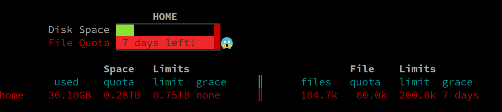
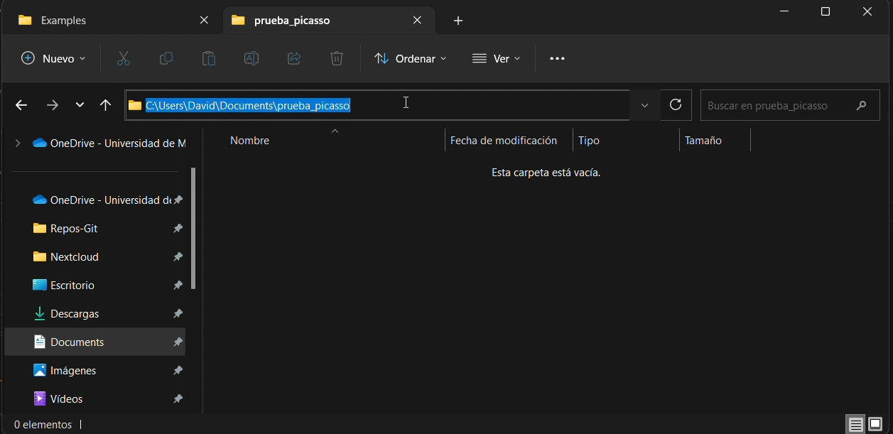

# User's manual

This is the official documentation for Picasso supercomputer usage. If you have any problem that is not specified on 
this documentation or in the [frequently asked questions](#sec_7) section please, contact us at 
```
soporte@scbi.uma.es.
```
# Index

- [1 - Citation and akcnowledges](#sec_1)
- [2 - About Picasso: Harware and Filesystems](#sec_2)
    - [2.1 - System overview](#sec_2.1)
    - [2.2 - Hardware resources](#sec_2.2)
        - [2.2.1 - Total compute resources](#sec_2.2.1)
        - [2.2.2 - Available resources](#sec_2.2.2)
    - [2.3 - File system](#sec_2.3)
        - [2.3.1 - Picasso Filesystems](#sec_2.3.1)
        - [2.3.2 - File and space quota](#sec_2.3.2)
        - [2.3.3 - Fast scratch filesystem (FSCRATCH)](#sec_2.3.3)
        - [2.3.4 - Local scratch filesystem](#sec_2.3.4)
        - [2.3.5 - Backup policy](#sec_2.3.5)
- [3 - Login to Picasso](#sec_3)
    - [3.1 - SSH connection](#sec_3.1)
    - [3.2 - Terminal](#sec_3.2)
    - [3.3 - Important notice](#sec_3.3)
- [4 - How to send jobs](#sec_4)
    - [4.1 - Preparing to send a job](#sec_4.1)
    - [4.2 - Modifying resources and limits](#sec_4.2)
    - [4.3 - Asking for GPUs](#sec_4.3)
    - [4.4 - Sample jobs generator](#sec_4.4)
    - [4.5 - Sending a job](#sec_4.5)
    - [4.6 - Array jobs: how to send lots of jobs](#sec_4.6)
    - [4.7 - Monitoring queued jobs](#sec_4.7)
        - [4.7.1 - Squeue command](#sec_4.7.1)
        - [4.7.2 - New online job monitoring](#sec_4.7.2)
    - [4.8 - Cancelling jobs](#sec_4.8)
    - [4.9 - Using the LOCALSCRATCH filesystem](#sec_4.9)
- [5 - Copy files from/to picasso](#sec_5)
    - [5.1 - Downloading files from internet](#sec_5.1)
        - [5.2.1 - Scp command](#sec_5.2.1)
        - [5.2.2 - Rsync command](#sec_5.2.2)
    - [5.2 - Copying files from your computer to picasso and viceversa ](#sec_5.2)
- [6 - Software](#sec_6)
    - [6.1 - Installed software](#sec_6.1)
    - [6.2 - Who to load/unload software](#sec_6.2)
        - [6.2.1 - Load software](#sec_6.2.1)
        - [6.2.2 - List the loaded software](#sec_6.2.2)
        - [6.2.3 - Unload software](#sec_6.2.3)
    - [6.3 - Compiling software](#sec_6.3)
- [7 - Picasso's own commands](#sec_7)
- [8 - FAQs](#sec_8)
    - [8.1 - How much resources should I ask for my jobs?](#sec_8.1)
    - [8.2 - Error message: Connection refused/Network is unreachable](#sec_8.2)
    - [8.3 - Error message: Remote host identification has changed ](#sec_8.3)
    - [8.4 - How do I change my password?](#sec_8.4)
    - [8.5 - Why is my process in the login node being cancelled?](#sec_8.5)
    - [8.6 - Why is my job queued for so much time?](#sec_8.6)
    - [8.7 - Why does my job not get the resources I asked for?](#sec_8.7)
    - [8.8 - I need more time for my job](#sec_8.8)
    - [8.9 - Why has my job failed?](#sec_8.9)
    - [8.10 - Error message: cnf <command>](#sec_8.10)
    - [8.11 - Why has my job been cancelled?](#sec_8.11)
    - [8.12 - Error message: Out of memory handler](#sec_8.12)
    - [8.13 - Why can't I edit nor create new files?](#sec_8.13)
    - [8.14 - I need more space or file quota](#sec_8.14)


[//]: <> (==============================================================================================================)
[//]: <> (=============================================== SECCION ======================================================)
[//]: <> (==============================================================================================================)


# 1 - Citation and akcnowledges <a id="sec_1"></a>

If you use our resources, you must acknowledge this service on your publications. Please, add a text like this:

    The author thankfully acknowledges the computer resources, technical expertise and assistance 
    provided by the SCBI (Supercomputing and Bioinformatics) center of the University of Malaga"

We would appreciate if you could inform us of your publications that used our resources, and we will take the opportunity
to congratulate you.

[//]: <> (==============================================================================================================)
[//]: <> (=============================================== SECCION ======================================================)
[//]: <> (==============================================================================================================)


# 2 - About Picasso: Harware and Filesystems <a id="sec_2"></a>

## 2.1 - System overview <a id="sec_2.1"></a>

SCBI's supercomputing resources comprises a set of computation nodes with different characteristics. 
However, all those machines are unified behind a single **Slurm** queue system instance, so you shouldn't worry about their 
differences, as you only have to create a SBATCH script (a text file with some special syntax).

The script is used to **request the resources** (time, cpus, memory, gpus, etc) that your job will use. It is important 
that the resources asked can be optimally used, as this will help your job to start as soon as possible. Machines with 
special characteristics like a more memory or gpus are scarse, and because of that they are harder to reserve. 

Once you have your script written, you have to send it to the **queue system**. Then the queue system will analyze your 
request and send the job to the appropriate computers. There are some examples in chapter 
[How to send jobs](#sec_4). If you have any question, please, don't hesitate in contacting us at 
soporte@scbi.uma.es and we will do our best to try to help you.


## 2.2 - Hardware resources <a id="sec_2.2"></a>

### 2.2.1 - Total compute resources <a id="sec_2.2.1"></a>

In Picasso we have the following nodes:

- **sd nodes**: 126 x SD530 nodes: 52 cores (Intel Xeon Gold 6230R @ 2.10GHz), 192 GB of RAM. 
InfiniBand HDR100 network. 950 GB of localscratch disks

- **bl nodes**: 24 x Bull R282-Z90 nodes: 128 cores (AMD EPYC 7H12 @ 2.6GHz), 2 TB of RAM. 
InfiniBand HDR200 network. 3.5 TB of localscratch disks.

- **sr nodes**: 156 x Lenovo SR645 nodes: 128 cores (AMD EPYC 7H12 @ 2.6GHz), 512 GB of RAM. 
InfiniBand HDR100 network. 900 GB of localscratch disks.

- **bc nodes**: 34 x Lenovo SR645 v3 nodes: 256 cores (AMD EPYC 9754 @ 2.25GHz), 768 GB of RAM.
InfiniBand 2x HDR200 network. 4 TB of localscratch disks.

- **exa (GPU) nodes**: 4 x DGX-A100 nodes: 8 GPUs (Nvidia A100), 1 TB of RAM. 
InfiniBand HDR200 network. 14 TB of localscratch disks.

### 2.2.2 - Available resources <a id="sec_2.2.2"></a>

Both the operating system and the file system require part of the resources (RAM) available on the nodes. For this 
reason, the resources (CPUs, RAM) that can be requested for each node through the queuing system are as follows:
- **sd nodes**: CPUs: 52 cores. RAM: 182 GB
- **bl nodes**: CPUs: 128 cores. RAM: 1855 GB
- **sr nodes**: CPUs: 128 cores. RAM: 439 GB
- **bc nodes**: CPUs: 256 cores. RAM: 683 GB
- **exa (GPU) nodes**: CPUs: 128 cores. RAM: 878 GB

<span style="color: red"> IMPORTANT </span>: The resources of the Exa nodes are distributed among the 8 GPUs of each 
node, so in ideal usage no more than 16 cores and 109 GB of RAM should be requested per GPU requested.

<span style="color: red"> IMPORTANT </span>: if you aim to use a lot of files (ie. more than 15000) to solve a problem 
(for example, in IA training), you must contact with us first, because it can lead to serious performance problems.


## 2.3 - File system <a id="sec_2.3"></a>

### 2.3.1 - Picasso Filesystems  <a id="sec_2.3.1"></a>

The Picasso filesystem is divided in two physically independent spaces. In both of them, as a user of picasso, you will 
get some disk quota. The quota determines the disk limits for your user.
- **HOME** (*Permanent storage system*): Here you should store input data, your own developed scripts, final results, 
and other important data. To go to your home space you can enter one of the following commands:

```
    cd
```
```
    cd ~
```
```
    cd $HOME
```
- **FSCRATCH** (*Temporal storage system*): FSCRATCH is a very high speed storage in which you should launch your work.
You can find relevant information about using FSCRATCH in section [Fast scratch filesystem (FSCRATCH)](#sec_2.3.3). 
Be aware that FSCRATCH is a temporary storage, and old files will be deleted periodically. 
<span style="color: red">  PLEASE, DO NOT USE IT TO STORE IMPORTANT DATA </span>. 
To go to your fscratch space you can enter:

```console
    cd $FSCRATCH
```


### 2.3.2 - File and space quota <a id="sec_2.3.2"></a>

Apart from the **space limitation** in each of both spaces (home and fscratch), there is also a **file quota**. While 
the space quota determines the limitation in terms of gigabytes written, the file quota determines the limitation in 
terms of number of files written.

The quota works in two steps, that are called soft quota and hard quota: 
- **Soft quota**:  When you exceed your quota, you will receive a warning message every time you log into picasso, 
In the figure below, you can see an example of someone exceeding the soft quota of free space.
<div style="text-align:center">

</div>

- **Hard quota**: When you exceed your quota by a lot, you will find a hard limit which will not allow you to write any
more files, even if you were inside the 7 days of soft quota grace period.

One the cuota is reached (space or file quota), you have 7 days to return to the normal situation. If those 7 days pass
or the hard quota is reached, the disk writing will be blocked. 

In order to check your quotas, you can run the command:
```
quota
```
or 
```
mmlsquota
```

### 2.3.3 - Fast scratch filesystem (FSCRATCH) and purging policy <a id="sec_2.3.3"></a>

**- About FSCRATCH**

The FSCRATCH (Fast Scratch) filesystem should be used to speed up the jobs, specially the ones that make an intense use 
of the storage. This space is conceived as a pseudo-volatile filesystem. This means that the data stored here will be 
deleted periodically and automatically, so <span style="color: red"> you should not use it for storaging important files.
</span>:


To go to FSCRATCH, type 
```
cd $FSCRATCH
```
You can copy folders from HOME to FSCRATCH using command like:
```
cp -r $HOME/path/to/your/folder/in/home $FSCRATCH/path/to/target/folder
```
or from FSCRATCH to HOME using
```
cp -r $FSCRATCH/path/to/your/folder/in/fscratch $HOME/path/to/targe/folder
```

Don't forget to copy the important output data back to your HOME, because it 
will be deleted after some weeks.

**- Purging policy**

The files that have not been used for more than two months will be deleted automatically. 

Files will not be deleted after exactly two months, but files that have not been used for two months will be subject to 
deletion at any time without prior notice. The purge is triggered depending on the percentage of **total** FSCRATCH usage.

If you are not sure how to use FScratch, please contact us to soporte@scbi.uma.es.

### 2.3.4 - Local scratch filesystem <a id="sec_2.3.4"></a>

There are some nodes that have a local scratch filesystem. This local scratch is even faster than the fscratch 
filesystem, but it has a main disadvantage: It is only accessible from each node, so you cannot access it from the login
machine, but only from inside the SBATCH script that you will send to the queue system (using the $LOCALSCRATCH 
environment variable).

The local scratch is very fast, and may speed up some jobs substantially when used. And it's a must when a job needs to 
write lots of files or to make an intense disk usage.  You can also find an example in the section 
[How to send jobs](#sec_4).

If you think you need access to local scratch and you are not sure how to use it, please contact us to 
soporte@scbi.uma.es.

### 2.3.5 - Backup policy <a id="sec_2.3.5"></a>

<span style="color: red"> IMPORTANT NOTE </span>: It is important that you follow a responsible backup policy. We are 
not liable for the loss of data stored in our systems, so if your data is important, you should have backups of it in 
your own machine or backup system. As a courtesy we maintain a backup of the files stored in the home directory, but we 
cannot neither warranty it nor make backups of all the space available. You can follow these backup guidelines if you 
like:

- It is a good habit to use a version control system for your own programs and scripts. Git can be a good solution 
(https://git-scm.com/). Version control systems helps programmers to keep a tracking of all changes made to source code, 
scripts, etc... Every time that you make a change to a file, you can save it to your version control system with some 
textual description, and you can later see those changes at anytime or go back to an older version. 
This is not a true backup, but a kind of.
- Keep different backups, from different dates. Backup are also useful if you delete of modify a file by mistake.
- Store backups in different physical places. This way, if your main computer location suffers a disaster, you could 
access another copy that you have in another place.
- Try to access your backup data periodically. You can make lots of backups, but if they are not accessible they are 
not useful.

[//]: <> (==============================================================================================================)
[//]: <> (=============================================== SECCION ======================================================)
[//]: <> (==============================================================================================================)

# 3 - Login to Picasso <a id="sec_3"></a>

Like most supercomputers, Picasso is based on a Linux distribution, in this case openSuse Leap 15.4. Remote system 
access is done by SSH protocol (port 22), connecting to a login server. In this server you will find all compilers and 
tools needed to prepare and send your jobs to the queue system.


## 3.1 - SSH connection <a id="sec_3.1"></a>

To connect to the login server you will need to enter the following command on the **system terminal** (it can be CMD or
PowerShell in Windows, or the terminal of Linux and MacOs):
```
ssh <username>@picasso.scbi.uma.es
```
For example, if your username is *myuser*, you should enter:
```
myuser@picasso.scbi.uma.es
```
After this, you will be prompted to enter your password. When entering it, you will see that **nothing appears on the** 
**screen**, but it is being registered. Press enter when you are done, and the connection should be established.

<span style="color: red">  Warning </span>: If you fail to enter the password for several times, the system will block 
your IP. It will be unblock after 30 minutes. If you fail serveral times again, the ip will be permanently blocked. You 
will have to contact us to soporte@scbi.uma.es in order to get unbanned.

Tip: if you have session issues and your connection brokes after a short innactivity time or because of Internet 
connection stability; you must include a keep alive command in your connections:
```
ssh ServerAliveInterval=60 myuser@picasso.scbi.uma.es
```

## 3.2 - MobaXTerm <a id="sec_3.2"></a>

If you are not familiar with terminals, maybe you can try to use program 
<a href="https://mobaxterm.mobatek.net/" target="_blank">MobaXTerm</a>. 
It is more user fiendly and allow thing like copy a file using the mouse. 

## 3.3 - Important notice <a id="sec_3.3"></a>

<span style="color: red">  IMPORTANT NOTE </span>: When you access Picasso, you are entering one of our nodes, the 
**login node**. The login node is not a place to execute your work. It can be used for building scripts, compiling 
programs, testing that a complex command that you are going to use in the SBATCH script is launching correctly, etc, 
but NOT for making real work.  All launched programs will be automatically killed without previous notice when they use 
more than 10 minutes of cpu time.

Real woks must be send to the **queue system** (see section [How to send jobs](#sec_4)).

[//]: <> (==============================================================================================================)
[//]: <> (=============================================== SECCION ======================================================)
[//]: <> (==============================================================================================================)

# 4 - How to send jobs <a id="sec_4"></a>

Our current queue system is **Slurm**. So any <a href="https://slurm.schedmd.com/documentation.html" target="_blank">Slurm's manual</a>
will give you more detailed information about these commands. This is only a quickstart guide:

## 4.1 - Preparing to send a job  <a id="sec_4.1"></a>

Prior to sending a job to the queue system you only have to write a small script file with a specific format. We call 
this script **SBATCH script*. This is where the resources are requested from the queuing system and where the execution 
sentences are placed. This script is written in bash language (the same as in the terminal).

In Picasso we have a command to generate a template for this type of scripts
```
gen_sbatch_file script.sh "executing_command"
```
This command will generate an script call "script.sh" with the command "executing_command". You only have to edit this 
file to adjust the resources you want to request, load the modules and adjust the execution statement. In the section 
[Modifying resources and limits](#sec_4.2) we will how to do it.

Each software has its own form of calling it for solving a job, but don't panic, as you will find all the details in the 
individual intructions, guides or readme files of each software.


## 4.2 - Modifying resources and limits <a id="sec_4.2"></a>

Here we are going to see who to modify the sample SBATCH script generate with the command 
```
gen_sbatch_file script.sh "executing_command"
```
If you enter this file you will see something like this:
```
#!/usr/bin/env bash
# Leave only one comment symbol on selected options
# Those with two commets will be ignored:
# The name to show in queue lists for this job:
##SBATCH -J script_2.sh

# Number of desired cpus (can be in any node):
#SBATCH --ntasks=1

# Number of desired cpus (all in same node):
##SBATCH --cpus-per-task=1

# Amount of RAM needed for this job:
#SBATCH --mem=2gb

# The available nodes are:
#     AMD nodes with 128 cores and 1800GB of usable RAM
#     AMD nodes  with 128 cores and 439GB of usable RAM
#     Intel nodes with 52  cores and 187GB of usable RAM

# The time the job will be running:
#SBATCH --time=10:00:00

# If you need nodes with special features you can select a constraint.
# Please, use cal by default. You will be assigned a node that satisfies your requests.
#SBATCH --constraint=cal

# Change "cal" by "sd" if you want to use Intel nodes and by "sr" if you want to use AMD nodes.
##SBATCH --constraint=sd
##SBATCH --constraint=sr

# To use GPU, comment out the constraint line and uncomment the following line.
##SBATCH --gres=gpu:1

# Set output and error files
#SBATCH --error=job.%J.err
#SBATCH --output=job.%J.out

# Leave one comment in following line to make an array job. Then N jobs will be launched. In each one SLURM_ARRAY_TASK_ID will take one value from 1 to 100
##SBATCH --array=1-100

# To load some software (you can show the list with 'module avail'):
# module load software


# the program to execute with its parameters:
time executing_command
```

First of all, you have to know that in bash all the lines starting with "#" are **comments**. As you can see, almost all
are comments. **Sentences for requesting resources to the queuing system must be commented**. They should start with 
`#SBATCH`. If it starts with two or more '#', the sentence will be ignore. 

In the previous example, the sentences to be taken into account are as follows
- `#SBATCH --ntasks=1`: &nbsp;  Number of tasks (processes). If you use parallelization libraries like MPI, this number should 
be equal to the number of MPI tasks.
- `#SBATCH --mem=2gb`: &nbsp; Total RAM requested. If the job tries to use more than this memory, it will end up with 
an `out_of_memory` error.
- `#SBATCH --time=10:00:00`: &nbsp; Total execution time. When this time is used up, the job will be cancelled.
- `#SBATCH --constraint=cal`: &nbsp; This is to select the type of nodes on which you want to run the job. "cal" means any 
(except GPU nodes).
- `#SBATCH --error=job.%J.err`: &nbsp; Name of the file where the error messages of the program execution will be saved 
(%J will be replaced by the job id).
- `#SBATCH --output=job.%J.out`: &nbsp; Name of the file where the output messages of the program execution will be saved 
(%J will be replaced by the job id).

In the above example some '##' statements have been included and will be ignored. They are so in case they are 
necessary, they can be uncommented. This sentences are
- `##SBATCH -J script_2.sh`: &nbsp; This is to change the name under which the job will appear in the queue. By default, it is 
assigned the same name as the SBATCH script.
- `##SBATCH --cpus-per-task=1`: &nbsp; This is to change the number of CPUs requested by each task. By default 1 CPU per task 
is assigned
- `##SBATCH --constraint=sd`: &nbsp; This is so that the job can only enter the sd (Intel) nodes.
- `##SBATCH --constraint=sr`: &nbsp; This is so that the job can only enter the sr (AMD) nodes.
- `##SBATCH --constraint=bc`: &nbsp; This is so that the job can only enter the bc (AMD) nodes.
- `##SBATCH --gres=gpu:1`: &nbsp; This is for requesting GPUs. First the statements must be commented with "--constraint". The 
number at the end refers to how many GPUs are being requested. 
- `##SBATCH --array=1-100`: &nbsp; This is for using the array jobs. It will be explained in section 
[Array jobs: how to send lots of jobs](#sec_4.6)


<span style="color: red">  IMPORTANT NOTES: </span>

- All #SBATCH commands  should go at the head of the file, without uncommented lines above them, because any SBATCH line after the first uncommented line will be ignored by slurm. 
- Resources limits have hard policies. It means that, if you exceed requested resources, your job will be killed.
- You can evaluate the resources that a job has effectively utilized by running ``seff id_job`` when it has already 
finished (`seff` command doesn't work it the job is running). This will allow you to adjust resources for optimal 
utilization (your jobs will start to solve sooner). You can also use the new
<a href="https://www.scbi.uma.es/slurm_monitor/admin?locale=es" target="_blank">online job monitor</a>
for this task. In the section 
[Monitoring queued jobs](#sec_4.7), you can find more details about it. 

<span style="color: Purple">  For old users: </span> New Slurm version has changed command --cpus for --cpus-per-task. 
You must update your scripts in order to obtain requested resources

## 4.3 - Asking for GPUs <a id="sec_4.3"></a>

As briefly discussed in the previous section, to order GPUs, the "--constrain" lines must be commented (with two '##'):
```
##SBATCH --constraint=cal
```
and the line 
```
#SBATCH --gres=gpu:1
```
must be uncomented (only one '#'). If you want to use more than one GPU, just change the "1" for another number. 
Remember that our exa nodes have 8 GPUs each.


## 4.4 - Sample jobs generator <a id="sec_4.4"></a>

We also have written a tool that generates a complete sample job for some softwares. You can see a list of available 
sample jobs with this command:
```
gen_sample_job | grep -v NO
```
When you have located the desired sample job, you can generate it with the following command:
```
gen_sample_job <sofware> <output_foler>
```
Where `<software>` is the desired software without the version, and `<output_folder>` is the folder that will be created
to contain the sh script and other needed files. For example, if you wanted to create a sample job for the software 
Gaussian in a new folder called gaussian_job, you should enter:
```
gen_sample_job gaussian gaussian_job
```
<span style="color: Red">  Nota: </span> We do not have many examples and most of them may be old.

## 4.5 - Sending a job <a id="sec_4.5"></a>

When you have a modified version of the script.sh file adapted to your needs, you are ready to send it to the queue 
system. For doing so, you just have to enter:
```
sbatch script.sh
```
Now, the job has been received by the queue system, who will look for the resources requested. Once the resources are 
available, the job will begin.

In the section "Monitoring queued jobs" you will learn how to monitor the state of your jobs. This way, you will know if
the job is still looking for a place to be executed (queued) or if it is already running.


<span style="color: Red">  Important Note: </span> You will notice that if you requested resources adapted to your needs 
(and not in excess), your job will begin much faster, as it will find a place to be executed much easier. Also bear in 
mind that if you request lesser resources than what your job will need, the job will be immediately killed as soon as 
the resources are exceeded by the software.


## 4.6 - Array jobs: how to send lots of jobs <a id="sec_4.6"></a>

When you need to send a bunch of jobs that executes the same command over different data, you can make use of array jobs.
Array jobs are now a native option of slurm, so you will find advanced information about them in 
<a href="https://slurm.schedmd.com/documentation.html" target="_blank">Slurm's manual</a>.

To use array jobs, you only need to do a few changes to the script file. At first, remove one comment symbol from the 
`--array` line (leaving it only with one comment simbol '#'):
```
# Leave one comment in following line to make an array job. Then N jobs will be launched. In each one SLURM_ARRAY_TASK_ID will take one value from 1 to 100
#SBATCH --array=1-100
```
In this way, Slurm will send 100 job, with the only difference that the enviromental variable `SLURM_ARRAY_TASK_ID` 
varies from 1 to 100. One way to use it to pass different data files to the program for each run is to name the files in
the form "data_0, data_1,..., data_100" and call the program in the form
```
time my_command data_${SLURM_ARRAY_TASK_ID}
```

You can also choose some specific values to this variable, for example `7,55,87,95,4,2`:
```
#SBATCH --array=7,55,87,95,4,2
```

After these modifications, you have to send it to the queue system, using the normal sbatch command:
```
sbatch script.sh
```

<span style="color: Red">  Nota: If you are going to send an arrayjob bigger than 1000 jobs for the first time, please, 
contact us first. </span>


## 4.7 - Monitoring queued jobs <a id="sec_4.7"></a>

### 4.7.1 - Squeue command <a id="sec_4.7.1"></a>

At any time, you can monitor the queue of jobs by issuing this command:
```
squeue
```
By default squeue shows jobs in short format (grouping array jobs together). If you need to access the long format, 
use the `-l` flag:
```
squeue -l
```

### 4.7.2 - New online job monitor <a id="sec_4.7.2"></a>

For more detailed information about your running jobs, you can access the new online job monitor. This utility will show 
you details in real time about the number of CPUs and amount of RAM being used, and also the GPU and VRAM usage if it is 
the case. For using the online monitor follow these instructions:

1. Enter https://www.scbi.uma.es/slurm_monitor/admin/login
2. Login with your picasso user credentials
3. You will see a list of all of your running or finished jobs
4. By using the first row controls you can sort the jobs by any column
5. When using the filters on the right, only the jobs you are interested in will be shown
6. Click on the desired job
7. You will see more details at the top, and real time graphics below
8. By clicking on the different items of the legend you can hide or show their corresponding graph
    - System: It can be an indicator of disk usage. If it is high you should use localscratch
    - New proc: A vertical line will show up every time a new proccess has been detected. It is useful when you use 
    multiple programs in your script.
    - Reserved cores: Horizontal line with the cores that were asked.
    - Reserved RAM: Horizontal line with the GB of RAM that were asked.
    - RAM: RAM actually used.
    - Cores: CPU cores actually used.

Remember that if you adjust your asked resources to the ones that you can actually use, your job will begin to solve 
sooner as it will find faster a place to be executed. Also, more resources will be available for other users in picasso.


## 4.8 - Cancelling jobs <a id="sec_4.8"></a>

At some times, you will want to cancel a job that is already running or queued. To do so, you only have to take the job 
id number (first column shown in squeue), and issue this command:
```
scancel <JOBID>
```
where `<JOBID>` is the number of the job that will be cancelled.

To cancel only some jobs of an array job, use this format:
```
scancel <JOBID>_[1-50]
```
In that example, you would have cancelled the jobs 1 to 50 from the array job with id JOBID

## 4.9 - Using the LOCALSCRATCH filesystem <a id="sec_4.9"></a>

By default, you can work and create temporary files on your normal $FSCRATCH filesystem, but sometimes you may need to 
use a program that generates thousands and thousands of temporary files very fast. That is not a good citizen behaviour 
for shared file systems, since each small file creation do a few requests to the shared storage to get completed. 
If there are thousands of them, they can hog the system at some point.

In this extreme cases, it is mandatory to use the $LOCALSCRATCH filesystem. In less extreme situations, in which 
software executes large I/O operations, you can also take advantage of the speed up that the Localscratch filesystem 
provides. As seen in the hardware section, all machines have at least 900GB of localscratch. 
**For high localscratch usage, please contact us first.**

The localscratch filesystem is independent to each node, and thus, it is not shared between nodes and it's not accesible 
from the login machines. Because of that, you have to understand how to copy your data there, use it, and later on, 
retrieving the important results back to your home (all done inside the sbatch script). Here you can find an example 
that could help you in this tasks. Feel free to contact us if you have any questions.

```
#!/usr/bin/env bash
# Leave only one comment symbol on selected options
# Those with two commets will be ignored:
# The name to show in queue lists for this job:
##SBATCH -J script_2.sh

# Number of desired cpus (can be in any node):
#SBATCH --ntasks=1

# Number of desired cpus (all in same node):
##SBATCH --cpus-per-task=1

# Amount of RAM needed for this job:
#SBATCH --mem=2gb

# The available nodes are:
#     AMD nodes with 256 cores and 683GB of usable RAM
#     AMD nodes with 128 cores and 1800GB of usable RAM
#     AMD nodes  with 128 cores and 439GB of usable RAM
#     Intel nodes with 52  cores and 187GB of usable RAM

# The time the job will be running:
#SBATCH --time=10:00:00

# If you need nodes with special features you can select a constraint.
# Please, use cal by default. You will be assigned a node that satisfies your requests.
#SBATCH --constraint=cal

# Change "cal" by "sd" if you want to use Intel nodes and by "sr" if you want to use AMD nodes.
##SBATCH --constraint=sd
##SBATCH --constraint=sr

# To use GPU, comment out the constraint line and uncomment the following line.
##SBATCH --gres=gpu:1

# Set output and error files
#SBATCH --error=job.%J.err
#SBATCH --output=job.%J.out

# Leave one comment in following line to make an array job. Then N jobs will be launched. In each one SLURM_ARRAY_TASK_ID will take one value from 1 to 100
##SBATCH --array=1-100

# To load some software (you can show the list with 'module avail'):
# module load software

# create a temp dir in localscratch
MYLOCALSCRATCH=$LOCALSCRATCH/$USER/$SLURM_JOB_ID
mkdir -p $MYLOCALSCRATCH

# execute there the program
cd $MYLOCALSCRATCH
time program1 $HOME/data/data1 > results

#copy some results back to home
cp -rp your_results $HOME/place_to_store_results

#remove your localscratch files:

if cd $LOCALSCRATCH/$USER; then
if [ -z "$MYLOCALSCRATCH" ]; then
rm -rf --one-file-system $MYLOCALSCRATCH
fi
fi
```


[//]: <> (==============================================================================================================)
[//]: <> (=============================================== SECCION ======================================================)
[//]: <> (==============================================================================================================)


# 5 - Copy files from/to picasso <a id="sec_5"></a>

At sometime you will need to copy files from, or into, picasso. We have to differentiate two cases: 

## 5.1 - Downloading files from internet <a id="sec_5.1"></a>

In case you want to **download** a file into picasso from a url available on **internet**, you can download it using wget 
command in picasso console:
```
wget <url>
```
For example, to download a file from the url https://www.example.com/file.txt, you have to use:
```
wget https://www.example.com/file.txt
```
It is usual that wget <url> command does not work when the file you need to download requires you to enter a password, 
to login into some account, or to make some other action before downloading. In these cases you will need to install a 
plugin for your web browser. This plugin will generate the complete working wget command for you. Then you will just 
have to paste the command in picasso and wait for the download to finish. These are the steps you need to follow:

1. Download and install one of these plugins depending on the web browser that you use 
(<a href="https://chrome.google.com/webstore/detail/curlwget/dgcfkhmmpcmkikfmonjcalnjcmjcjjdn" target="_blank">curlwget</a>
for chrome, 
<a href="https://addons.mozilla.org/es/firefox/addon/cliget/" target="_blank">cliget</a>
[]() for firefox, 
<a href="https://microsoftedge.microsoft.com/addons/detail/curlwget/njimejjehbbfhipbgakbleoobdgdcmof" target="_blank">curlwget</a>
for edge).
2. Start the download (in your computer) of the file you are interested in, then stop the download.
3. Now click on the plugin icon (usually in the top right corner of your web browser).
4. The complete wget command should appear. Copy the complete wget command.
5. Paste it in picasso and press enter. The download should start.


## 5.2 - Copying files from your computer to picasso and viceversa <a id="sec_5.2"></a>

### 5.2.1 - Scp command <a id="sec_5.2.1"></a>

In case you need to *copy* a file from/to picasso to/from your computer, you can use the comand 
```
scp -r <from_path_file> <to_destination_path>
```
This command can be used to copy in both directions.

**To copy from picasso to your computer:**
```
scp -r <user>@picasso.scbi.uma.es:<file_path_in_picasso> <file_local_destination>
```
You can obtain the path to a folder in Picasso using the comand 
```
pwd
```
You have to move to the folder you want to copy and execute this command.

**To copy from your computer to picasso:**
```
scp <file_local_destination> <user>@picasso.scbi.uma.es:<file_destination_in_picasso>
```
To get its local path on your computer, you can simply click on the top bar of the file explorer and copy the path, 
as you can see in the figure 
<div style="text-align:center">

</div>

### 5.2.2 - Rsync command <a id="sec_5.2.2"></a>

If you want to copy a lot of files, we recommend the use of the rsync command, is very similar to scp, but rsync can 
skip already transferred files, so it makes a synchronization instead of a full copy. The sintax is very similar 

**To copy from picasso to your computer:**
```
rsync -CazvHu <user>@picasso.scbi.uma.es:<file_path_in_picasso> <file_local_destination>
```
**To copy from your computer to picasso:**
```
rsync -CazvHu <file_local_destination> <user>@picasso.scbi.uma.es:<file_destination_in_picasso>
```
<span style="color: red">  NOTE </span>: For heavy transfers we recommend using the rsync command, since if the transfer 
is interrupted by any reason it will skip existing files when you try to upload them again.


[//]: <> (==============================================================================================================)
[//]: <> (=============================================== SECCION ======================================================)
[//]: <> (==============================================================================================================)

# 6 - Software <a id="sec_6"></a>

## 6.1 - Available software <a id="sec_6.1"></a>

We have a wide variety of software installed ready to use. You can browse the updated list in our 
<a href="https://www.scbi.uma.es/site/scbi/software" target="_blank">web</a>
(it can be deprecated), or by executing this command on the login 
server (recommended):
```
module avail
```
To search for a specific software
```
module avail | grep -i software_name
```
For example, to search for installations of a software such as WRF (Weather Research and Forecasting), you can use the command
```
module avail | grep -i wrf
```

## 6.2 - Who to load/unload software <a id="sec_6.2"></a>

### 6.2.1 - Load a software <a id="sec_6.2.1"></a>

To load a module you only have to execute the command
```
module load software_name
```
You can obtain the names of the software with the commands in the previous section.

For example, if you want to load the 4.4.2 version compiled for intel of WRF you have to type
```
module load WRF/4.4.2_intel_mpi
```
You must include the module load command in you SBATCH script. (It work )

It also works if you run the module load in terminal before sending the job to the queuing system, but it is not 
recommended because of its tediousness. This is because every time you access Picasso you start a "clean" session 
(without any module loaded), so you would have to load the modules whenever you enter Picasso.

If you want to execute commands directly in terminal (like opening an interpreter of one of our python versions), you 
will have to load the module by executing it in terminal.

### 6.2.2 - List the loaded software <a id="sec_6.2.2"></a>

To see the packages that you have already loaded:
```
module list
```

### 6.2.3 - Unload software <a id="sec_6.2.3"></a>

To unload any previously loaded package:
```
module unload software_name
```
For example, if you want to unload the previously loaded WRF:
```
module unload WRF/4.4.2_intel_mpi
```
You can also use the following command to unload all the software that you may have loaded. (Note: if you disconnect 
from picasso, all the software is automatically unloaded).
```
module purge
```

## 6.3 - Compiling software <a id="sec_6.3"></a>

To compile your own software you can use different compilers (gcc, intel, pgi,... ). Each software has its own build 
instructions, but normally you can compile it with different compilers. 

Gcc is the default, but the intel compiler can give your code some speedup. To compile using the Intel compiler you 
should load it first:
```
module load intel/2022.3
```

# 7 - Picasso's own commands <a id="sec_7"></a>

From the Picasso support team we have developed a series of commands to help users. These are as follows

- `count_files`:  This command will return the number of files inside the folders of the current directory.
- `free_gpus.sh`: This command will show you the avaliable GPUs
- `resource_efficiency`: This command generate the graph that you can se when you enter Picasso. It shows you the 
percentage of CPU and RAM used with respect to the total requested for the last 5 jobs that have 
**successfully completed**. You can also generate the graph for the jobs you want by passing the ids of the jobs to the 
command:
    ```
    resource_efficiency job_id job_id job_id job_id job_id
    ```
    You can also see the help message with 
    ```
    resource_efficiency -h 
    ```


[//]: <> (==============================================================================================================)
[//]: <> (=============================================== SECCION ======================================================)
[//]: <> (==============================================================================================================)

# 8 - FAQs <a id="sec_8"></a>

This section contains answers to Frequently Asked Questions: 

## 8.1 - How much resources should I ask for my jobs? <a id="sec_8.1"></a>

It is important that the resources are adjusted to your needs. Too little resources will end up in cancelled jobs, and 
too much resources will end up increasing the time that your job needs to find a place to be executed, also resulting in 
lesser resources free for other users.

You can use the <a href="https://www.scbi.uma.es/slurm_monitor/admin?locale=es" target="_blank">online job monitor</a>
(explained in the subsection "[Monitoring queued jobs](#sec_4.7)") to evaluate if you are using the resources correctly.

Even if you are using all the cores you asked for, it does not have to mean that they are being correctly used. Some 
programs does not scale well.

As an example, there are programs that using 64 cores solve the problems nearly as twice as fast as when using 32 cores. 
Nevertheless, other programs are not that good, and can only improve the speed by a 10% in such a scenario, or even last 
more with 64 cores than with 32!

If you experiment this kind of problem, or if you need help adjusting the resources, prepare a job example that last 
about 2 hours to finish and conctact us at `soport@scbi.uma.es`

## 8.2 - Error message: Connection refused/Network is unreachable <a id="sec_8.2"></a>

If you receive this error message, your IP has been blocked because of too many failed login attemps. If you have not 
been automatically unbanned in 30 minutes, please contact us at `soporte@scbi.uma.es`


## 8.3 - Error message: Remote host identification has changed <a id="sec_8.3"></a>

If you see a message with some of these texts: "Remote host identification has changed"; "It is possible that someone is 
doing something nasty". Can be for several security breachs but, we have changed our fingerprint recently (July 2021). 
If you have not connected since this date, you must remove the old key and use the new one. To do this, please read the 
full warning message and you will identificate a text that says "You can use following command to remove the offending 
key:". After that, a command you must run is shown with your personal path to SSH keys. In a linux system it will be 
pre-assumable as:
```
ssh-keygen -R picasso.scbi.uma.es -f <yourPath>
```


## 8.4 - How do I change my password? <a id="sec_8.4"></a>

If you already know your password and you want to change it. You can achieve it by using the command:
```
passwd
```
It will ask you about your current password. Then, new password will be asked twice, and a successful change message 
will be eventually shown.

## 8.5 - Why is my process in the login node being cancelled? <a id="sec_8.5"></a>

The login machine is not a place to execute your work. It can be used for building scripts, compiling programs, testing 
that a complex command that you are going to use in the SBATCH script is launching correctly, etc. but NOT for making 
real work. All launched programs will be automatically killed without previous notice when they use more than 10 minutes 
of cpu time.


## 8.6 - Why is my job queued for so much time? <a id="sec_8.6"></a>

It is probably due to the resources that you ask are excessive. You will notice that if you requested resources adapted 
to your needs (and not in excess), your job will begin much faster, as it will find a place to be executed much easier. 
Also bear in mind that if you request lesser resources than what your job will need, the job will be immediately killed 
as soon as the resources are exceeded by the software.

If you asked for GPUs for your job, you can check the currently free GPUs available issuing:
```
free_gpus.sh
```


## 8.7 - Why does my job not get the resources I asked for? <a id="sec_8.7"></a>

All SBATCH pragram lines (for example #SBATCH --ntasks=8) should go at the head of the file, without uncommented lines 
above them, because any SBATCH line after the first uncommented line will be ignored by slurm. Probably this happened to 
your sbatch file.

## 8.8 - I need more time for my job <a id="sec_8.8"></a>

Users have a time limit of 3 or 7 days of maximum job timeframe. Asking for more than 3 days is risky, given that the 
possibility of any kind of error increases with time.

If even with 7 days it is not enough for your job, it clearly needs some optimization (parallelism, division, change of 
software, overall rethink, etc.). You can contact us at `soporte@scbi.uma.es` if you need help for this task.

## 8.9 - Why has my job failed? <a id="sec_8.9"></a>

You can take a look at the error and output log files to get clues about what happened.
The "Command not found" error is shown when picasso is unable to find the command you try to execute. It is commonly 
caused by forgetting to include a module load command prior to the call of the software concerned.


## 8.10 - Error message: cnf <command> <a id="sec_8.10"></a>

If your job tried to use more resources than what you requested, the job will be automatically cancelled. In the case 
that it was hogging the system in a way that interferes with other users' jobs or if the resources reserved for it were 
dramatically underused, we will cancel it manually.

## 8.11 - Why has my job been cancelled? <a id="sec_8.11"></a>

If your job tried to use more resources than what you requested, the job will be automatically cancelled. In the case 
that it was hogging the system in a way that interferes with other users' jobs or if the resources reserved for it were 
dramatically underused, we will cancel it manually.

## 8.12 - Error message: Out of memory handler <a id="sec_8.12"></a>

If your job tried to use more RAM than what you requested, the job will be automatically cancelled. Please, increase the
amount of RAM requested in your sbatch file and confirm it follows the structure #SBATCH `--mem=2gb`

## 8.13 - Why can't I edit nor create new files? <a id="sec_8.13"></a>

Probably you exceeded the quota. Use the 
```
mmlsquota
``` 
for checking it. Remember that you can reach both soft of hard quota because of the number of files written or because 
of the size of these files. When you removed enough files, you will be back able to create and edit files. For more 
information refer to the "[File system](#sec_2.3)" section.

If you did not exceed your quota, then, you might be trying to write in a folder, or edit a file in which you don't 
have the write permission.

## 8.14 - I need more space or file quota <a id="sec_8.14"></a>

Remember that you have two separate locations for your files, the $HOME (where you should store input data, your own 
developed scripts, final results, and other important data) and the $FSCRATCH (where you should launch your work).

Verify that you don't preserve any unwanted old files, and remove them if so. If you need to increase the quota because 
of some conda / python package, you should know that you don't have to install the complete environment in your user. It 
is enough to issue module load anaconda and then pip install only for the rest of packages that are not in the module.

If any of the above helps you, you can contact us at `soporte@scbi.uma.es`
